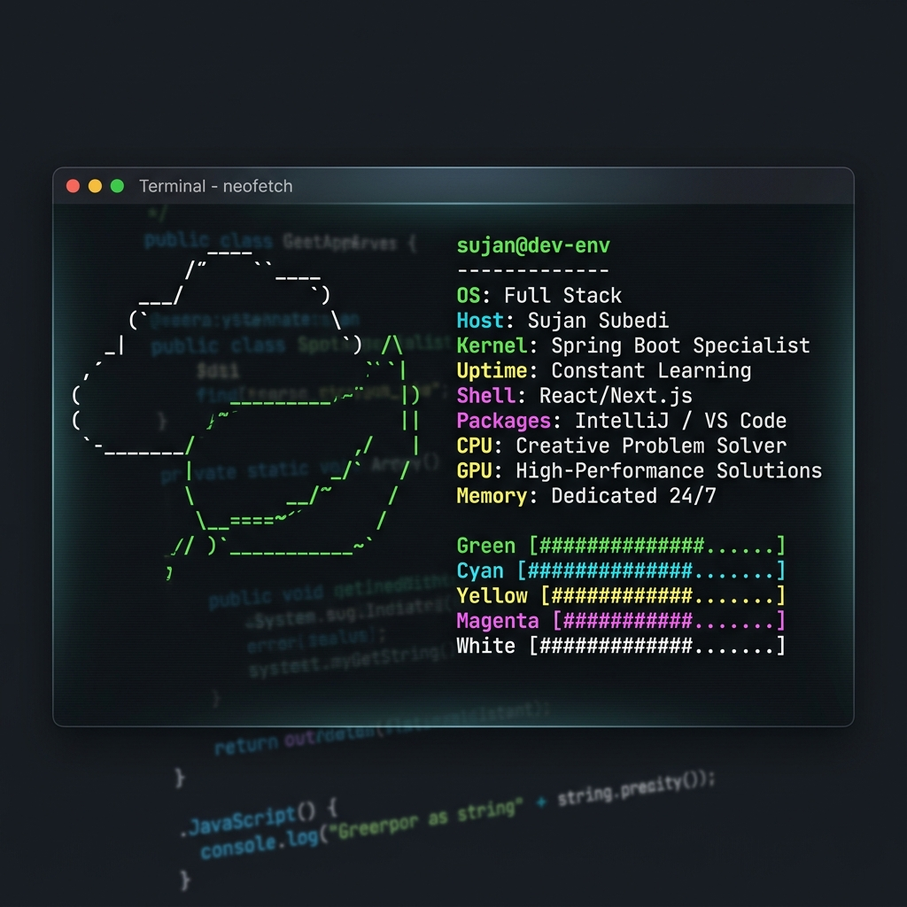

<div align="center">
  
</div>

<br />

```bash
$ whoami
> sujan-subedi (Rohit00112)
> Full Stack Engineer | Spring Boot & React Specialist
> "Building robust systems, one commit at a time."
```

---

### 📂 system/core/skills

```yaml
backend:
  - Spring Boot (Mastery)
  - Java (Expert)
  - Node.js / NestJS
  - PHP / Laravel
  - C# / .NET

frontend:
  - React / Next.js
  - TypeScript
  - Tailwind CSS
  - Framer Motion

infrastructure:
  - Docker / Containerization
  - PostgreSQL / MongoDB
  - Linux / Shell Scripting
  - Git / CI-CD
```

---

### 📦 system/software

```bash
[INSTALLED] IntelliJ IDEA (Primary IDE)
[INSTALLED] Visual Studio Code (Frontend)
[INSTALLED] Postman (API Testing)
[INSTALLED] Docker Desktop (Orchestration)
[INSTALLED] Figma (UI/UX Design)
```

---

### 📊 system/metrics --verbose

<div align="center">
  
  
</div>

<br />

<div align="center">
  
</div>

<br />

<div align="center">
  
</div>

<br />

---

### 🚀 system/status

- ⚡ **Current Focus**: Architecting high-throughput Spring Boot microservices.
- 🎨 **Design Goal**: Seamlessly blending cinematic UI with rock-solid logic.
- 📬 **Available for**: Collaborations, architectural consulting, and high-impact engineering.

---

### 🏆 system/uptime --achievements

```bash
[SUCCESS] 500+ Commits pushed this year
[SUCCESS] 10+ Enterprise systems architected
[SUCCESS] Spring Boot Professional Certification
[SUCCESS] Mastered Next.js App Router & Server Actions
```

---

### 🖥️ system/diagnostics

```text
[MEMORY]  #################### 85% (Dedicated)
[CPU]     ##################-- 75% (Multitasking)
[LATENCY] #################--- 70% (Responsive)
[UPTIME]  #################### 100% (Continuous)
```

---

### 🌐 remote/connect --secure

<p align="center">
  <a href="https://www.linkedin.com/in/sujan-subedi-32882720a/"><b>LinkedIn</b></a> •
  <a href="mailto:subedirohit49@gmail.com"><b>Email</b></a> •
  <a href="https://github.com/Rohit00112"><b>GitHub</b></a>
</p>

<br />

<div align="center">
  
</div>
